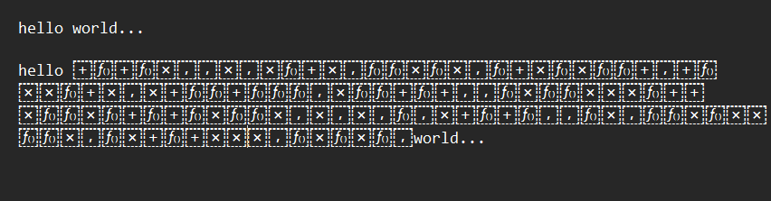
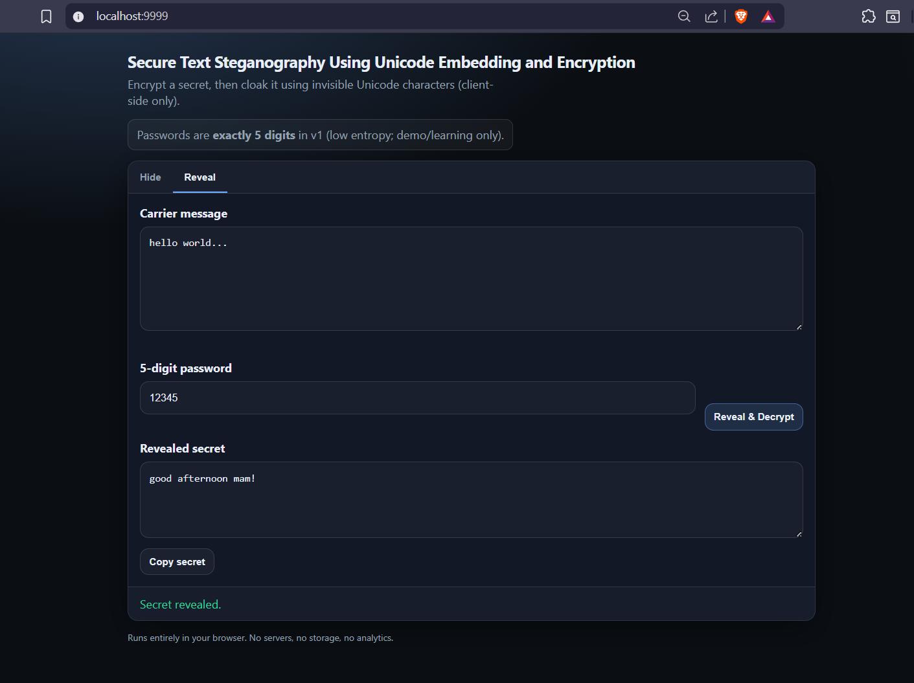

## Authors
- 23BAI1188 – M. Reddy Sasi Kiran
- 23BAI1222 – V. Jawahar Raju
- 23BAI1187 – C.R. Suhas

## Guide
Prof. Radhika Selvamani

## Core Insight
> Encryption hides the content  
> Steganography hides the existence  
> This system does both

# Secure Text Steganography Using Unicode Embedding and Encryption

A fully client-side web application that securely hides encrypted messages inside normal-looking text using Unicode zero-width characters.

This system combines cryptography + steganography + integrity verification to enable covert communication without any backend.

## Features
- Encrypts secret messages using AES-256-CTR
- Secure key derivation using PBKDF2 (SHA-512, 10k iterations)
- Integrity verification using HMAC-SHA256
- Embeds data using invisible Unicode zero-width characters
- Fully client-side (no server, no storage, no tracking)
- Works as a single static webpage

## How It Works

### Encryption + Embedding Pipeline
```
Secret Text
→ UTF-8 Encoding
→ Compression (optional)
→ Bitwise NOT
→ Salt Generation
→ PBKDF2 (Key + IV)
→ AES-256-CTR Encryption
→ HMAC-SHA256
→ Payload Construction
→ Binary → Unicode Mapping
→ Shrink Optimization
→ Embed into Cover Text
→ Carrier Text (final output)
```

### Decryption Pipeline
```
Carrier Text
→ Extract Invisible Data
→ Expand Stream
→ Unicode → Bytes
→ Split Payload
→ PBKDF2 (re-derive key)
→ AES-CTR Decryption
→ HMAC Verification
→ Reverse NOT
→ Decompression
→ Original Secret
```

## Example

**Step 1 – Enter secret**
- Cover Text: `hello world...`
- Secret Message: `good afternoon mam!`
- Password: `12345`

**Step 2 – Hidden output (looks normal)**
```
hello world...
```
Internally it contains an invisible encrypted payload.


**Embedded Text (copy-paste to test)**
```
hello world...‌‍⁡‌⁤⁡⁢⁣⁣⁢⁣⁢⁡⁤⁢‍⁣⁡‌‍⁡‌⁢‍⁡⁢‍⁣‌‍⁡‌‌‌⁤⁢⁡⁢⁡‌‍‍‍⁡‌‍‍‍⁤‍⁣⁤‍⁡‍⁢‌‌⁢⁡⁤⁢⁣⁢‍⁤⁡‌‌‍⁡‍⁤‌⁡‌⁡‌⁡‍‌⁣⁢⁡‌⁡⁤‌‌‍⁡‌⁤⁣‍‌⁣⁡⁢⁡‌‌⁡‌‍⁢‍‌⁢‍⁢‍⁡⁤⁤‍⁢⁡‌⁡⁢‌⁡⁤‍‍‍⁡⁤⁡⁢‍⁡‍⁡‍⁢‍⁣⁢⁣⁢⁣‌⁡‌‍‍‌⁣‍‍‍⁢‌⁤‌‌‍⁡⁤‍⁡‌⁣‌⁣‌⁡‍‌‍‌⁢‌‌‍⁣‍⁡‍⁡‍⁢‌⁡‍⁢‌‍⁢‍⁡‌⁡⁢‌⁣‌‌‍⁡⁢‍‌‍‍‍⁤⁡⁤‍⁢‍‌⁢‌‌
```



**Step 3 – Reveal**
- Password: `12345`
- Retrieved Text: `good afternoon mam!`


## Project Structure
```
index.html          → UI
styles.css          → Styling
js/app.js           → Main logic
js/ui.js            → UI helpers
js/core/            → Main cloak/reveal pipeline
js/crypto/          → PBKDF2, AES-CTR, HMAC
js/stego/           → Encoding, decoding, embedding
js/codec/           → Compression + bitwise transform
js/util/            → Helpers (bytes, clipboard, errors)
```

## Run Locally
This is a static project, so use a local server:

```bash
python -m http.server 9999
```

Then open: http://localhost:9999/

**Note:** Do NOT use file:// — Web Crypto APIs require a proper origin.

## Testing Scenarios
**Valid Cases**
- Normal text + password → correct reveal
- Unicode / emoji messages
- Auto-generated cover text
- Copy-paste within same browser

**Failure Cases**
- Wrong password → safe rejection
- Modified hidden characters → rejection
- Partial message → failure
- Removed invisible stream → "No hidden message detected"

## Platform Behavior
Tested on:
- WhatsApp / Telegram
- Gmail
- Google Docs / Word

Some platforms may strip invisible characters.

## Key Metrics
- Payload Capacity → amount of hidden data
- Imperceptibility → invisibility of embedding
- Robustness → survives platform transformations
- Security & Integrity → AES + HMAC protection

## Limitations
- 5-digit password is weak (demo purpose only)
- Unicode normalization may remove hidden data
- Detectable by advanced steganalysis
- Platform-dependent reliability

## Security Considerations (Attacker Perspective)
Even if an attacker extracts the invisible Unicode payload, they cannot recover the original message without the password.

- **Encrypted Payload (AES-256-CTR):** The hidden data is encrypted, so extracted bytes appear random. Without the correct key, decryption is computationally infeasible.
- **Key Derivation Hardening (PBKDF2 + Salt):** The AES key and IV are derived from the password using PBKDF2 with a random salt and 10,000 iterations. This prevents precomputed attacks and slows brute-force attempts.
- **Integrity Protection (HMAC-SHA256):** Any modification to the hidden data is detected. Tampering or wrong passwords result in rejection instead of incorrect output.
- **No Plaintext Exposure:** At no stage is the original message stored or transmitted in readable form — only encrypted payloads are embedded.

**Note:** Security depends on password strength. A 5-digit password is intentionally limited for demo purposes and is vulnerable to brute-force attacks.

## Literature References
- https://www.researchgate.net/publication/314449134_A_HYBRID_TEXT_STEGANOGRAPHY_APPROACH_UTILIZING_UNICODE_SPACE_CHARACTERS_AND_ZERO-WIDTH_CHARACTER
- https://www.researchgate.net/publication/348093211_A_High_Capacity_Text_Steganography_Utilizing_Unicode_Zero-Width_Characters
- https://arxiv.org/abs/2512.13325
- https://www.researchgate.net/publication/392984921_Enhancing_Imperceptibility_Zero-width_Character-based_Text_Steganography_for_Preserving_Message_Privacy
- https://www.sciencedirect.com/science/article/pii/S1319157820304249
- https://ieeexplore.ieee.org/document/8457957
- https://ieeexplore.ieee.org/document/9155493
